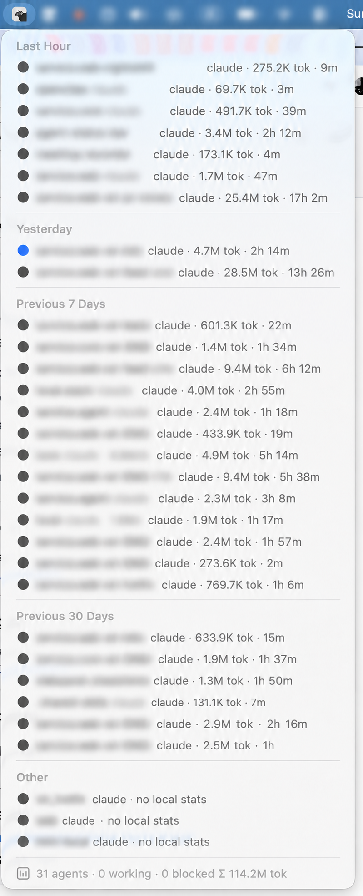

# Agent Status Bar

Raycast menu-bar extension showing **live AI coding agents** on this machine — how many, what type (claude/codex), their state (working / idle / blocked / done), plus per-agent token use and session runtime.

Complements [CodexBar](https://github.com/steipete/CodexBar) (which does account-level quotas/spend) by covering the process-level, real-time niche it doesn't: *which agents are running right now*.

<p align="center">
  
</p>

<p align="center"><sub>Agent names blurred. Every row is a live herdr agent; the footer sums the lot.</sub></p>

## How it works

- **Discovery**: one `herdr agent list` call per live herdr session socket (`~/.config/herdr/sessions/*/herdr.sock`). Returns type, state, session id and cwd for every agent — including remote agents over `sshl` that have no local process (they show state but "no local stats").
- **Claude tokens**: sums `message.usage` over the session transcript at `~/.claude/projects/<dashified-cwd>/<session>.jsonl`, read incrementally via Raycast `Cache` byte offsets (idle sessions cost one `stat`, zero reads).
- **Codex tokens**: tail-reads the latest cumulative `token_count` event from `~/.codex/sessions/YYYY/MM/DD/rollout-*.jsonl`.
- **Click a row**: `herdr agent focus <pane_id>` jumps to that agent's pane. Remote/unfocusable agents fall back to copying the cwd (with a HUD).
- **Runtime**: real working time — the sum of gaps between consecutive transcript messages, skipping any gap over 5 minutes. Wall-clock span is useless here: a resumed session's transcript can span weeks (one 335h idle gap), so file age reported 378h for under an hour of actual work. Codex still uses filename timestamp → mtime, since each rollout file is per-session.
- **Grouping**: Finder-style sections (Last Hour / Last 5 Hours / Today / Yesterday / Previous 7 Days / Previous 30 Days / Other) by last activity (transcript mtime); remote agents with no local transcript land in Other. Within each section, agents keep herdr's priority order (blocked > done > working > idle, newest state change first).
- **Blocked**: the logo's backdrop alternates yellow/orange on each 10s tick (`assets/herdr-menu-alert*.png`, rendered from `assets/logo.svg` with the backdrop rect repainted). No count — the colour says it. Notes: a `tintColor` won't work, the logo isn't a template image so tinting flattens the ram into a solid silhouette; swapping the *icon* rather than a title glyph avoids reflow, since emoji don't share an advance width and the bar resizes on every frame; and the flip is time-guarded because Raycast renders a menu-bar command **twice** per launch, so a render counter advances by two and the parity never changes. `isLoading` is what keeps a menu-bar command loaded long enough for a timer to fire; it's set only while something is blocked, so the rest of the time Raycast unloads the command and there's no resident process. While loaded Raycast skips its own background tick, so the component refreshes the rows itself. Both glyphs share one advance width — a mixed-width pair (✋/👋) resizes the whole menu bar on every frame.
- Refreshes every 10s in the background.

Requires [herdr](https://github.com/ogulcancelik/herdr). No herdr sessions → the menu shows "No herdr sessions found".

Icon is herdr's own logo (`assets/logo.svg` from the Apache-2.0 herdr repo), so the menu bar entry reads as herdr-related at a glance. Fine for personal use; ask the author before publishing this to the Raycast store, since a logo is a trademark matter separate from the code license.

## Develop

```bash
npm install
npm run dev      # ray develop — icon appears in the menu bar
npm test         # tsx self-check of the parsers/formatters
npm run build    # ray build — typecheck + bundle
```

## Not built yet (phase 2+)

- ps-scan fallback for agents running outside herdr
- local proxy (token-fence style) for real network bytes + $ cost per agent
- hooks→JSONL historical per-run analytics
- per-run trace drilldown (a second command; the row click is taken by focus)
- notification on state transition to blocked/done
- "waiting for approval" badge
